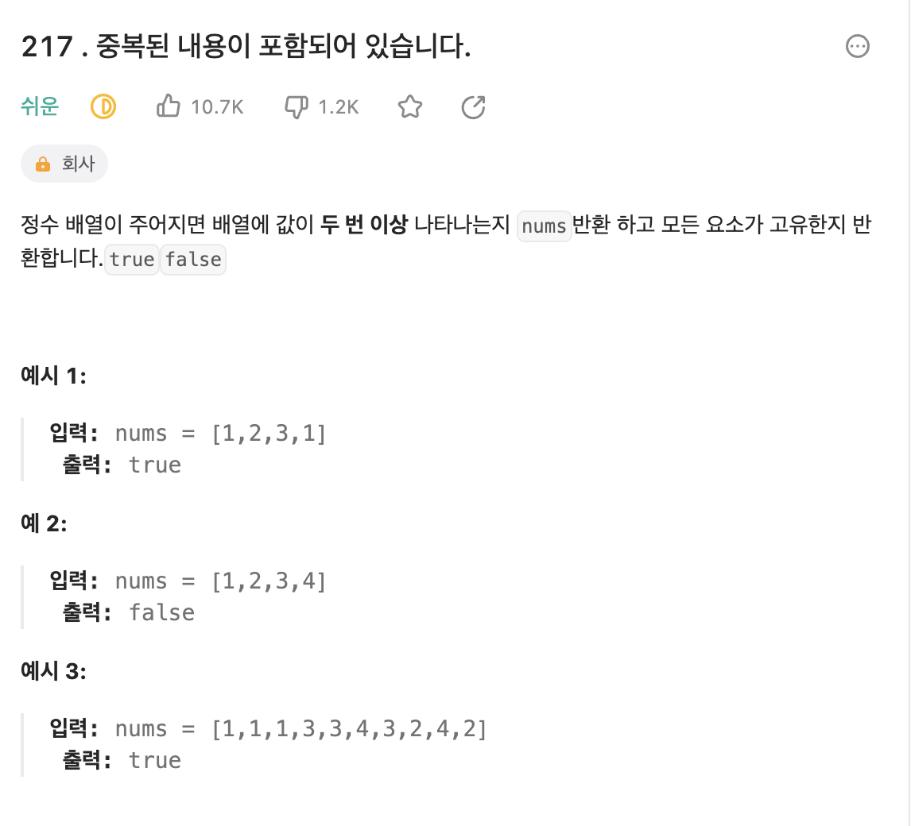

## 📚 문제



</br>

## 💡 문제 접근 방법

이 문제를 해결하기 위하여 배열의 원소를 각각 비교해 나가야 한다고 생각했다. 그래서 처음에 idx 변수를 정의해서 기준을 배열의 첫번째 요소로 잡은 뒤 중복된 값이 없으면 idx를 1씩 늘려가며 기준 요소를 변경하면서 비교하려고 했지만, 역시 중첩 루프를 사용해야 하는 방법이었다.

</br>

## 아쉬운 점

이번 문제는 최대한 중첩 루프를 사용하지 않는 쪽으로 작성하려고 노력했다. 하지만 set 생성자를 알았더라면, 더욱 간단하게 해결되는 문제임을 알았다. 따라서 오늘 set에 대해 정리해두고 앞으로는 활용하여 문제를 풀 수 있도록 해야겠다.
아래는 set 생성자을 활용한 코드이다.

```js
var containsDuplicate = function (nums) {
  const s = new Set(nums);
  return s.size !== nums.length;
};
```

</br>

## 📝 내가 작성한 코드

(제출 미완료)

```js
/**
 * @param {number[]} nums
 * @return {boolean}
 */
var containsDuplicate = function (nums) {
  let idx = 0;
  let num = 1;
  let value = nums[idx];
  while (idx < nums.length) {
    if (value === nums[num]) {
      return true;
    } else {
      num++;
    }
    idx++;
  }
  return false;
};
```

또 다른 js 풀이

```js
/**
 * @param {number[]} nums
 * @return {boolean}
 */
var containsDuplicate = function (nums) {
  nums.sort((a, b) => a - b); // 배열을 작은 수 부터 나열
  for (let i = 0; i <= nums.length - 1; i++) {
    if (nums[i] === nums[i + 1]) {
      return true;
    }
  }
  return false;
};
```

</br>

## 📖 배운 내용 블로그 정리 링크

🔗 https://velog.io/@chen4023/%EC%9E%90%EB%B0%94%EC%8A%A4%ED%81%AC%EB%A6%BD%ED%8A%B8-%EC%84%B8%ED%8A%B8Set
