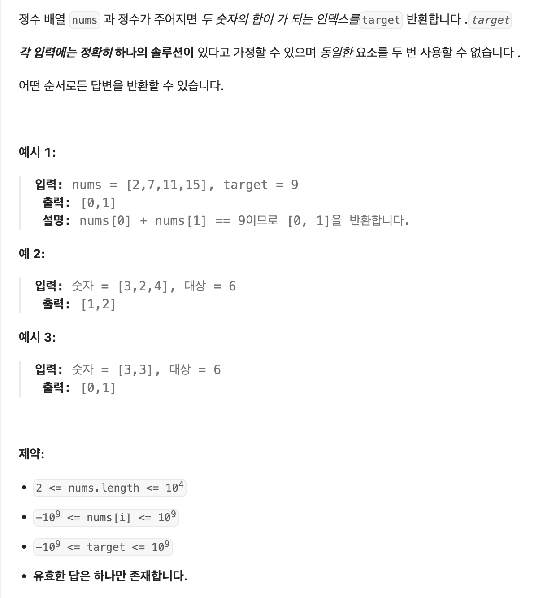

## 📚 문제



</br>

## 💡 문제 접근 방법

이 문제를 해결하기 위하여 배열의 각 요소를 반복하여 대상 숫자와 처리중인 현재 숫자 간의 합이 target과 일치하는지에 대해 파악을 해야 한다. 배열의 각 요소를 for 반복하여 숫자간의 합이 target과 일치하는지 확인하는 방법으로 접근했다.

</br>

## 아쉬운 점

나는 두개의 중첩 루프를 사용하여 배열을 반복하므로, 코드의 시간복잡도는 O(n^2)이 된다. 시간 복잡도를 고려하지 못한 점이 아쉬웠다. 따라서 해시를 사용하여 시간 복잡도를 줄이는 코드를 작성하는 방법을 알아봐야겠다.

```js
var twoSum = function (nums, target) {
  const numToIndex = new Map();

  for (let i = 0; i < nums.length; i++) {
    const complement = target - nums[i];

    if (numToIndex.has(complement)) {
      return [numToIndex.get(complement), i];
    }

    numToIndex.set(nums[i], i);
  }

  return [];
};
```

</br>

## 📝 내가 작성한 코드

```js
/**
 * @param {number[]} nums
 * @param {number} target
 * @return {number[]}
  nums : 정수배열
  target : 두 숫자의 합이 되는 인덱스를 target 반환 
 */
var twoSum = function (nums, target) {
  for (let i = 0; i < nums.length; i++) {
    for (let j = i + 1; j < nums.length; j++) {
      if (nums[i] + nums[j] === target) {
        return [i, j];
      }
    }
  }
  return [];
};
```
